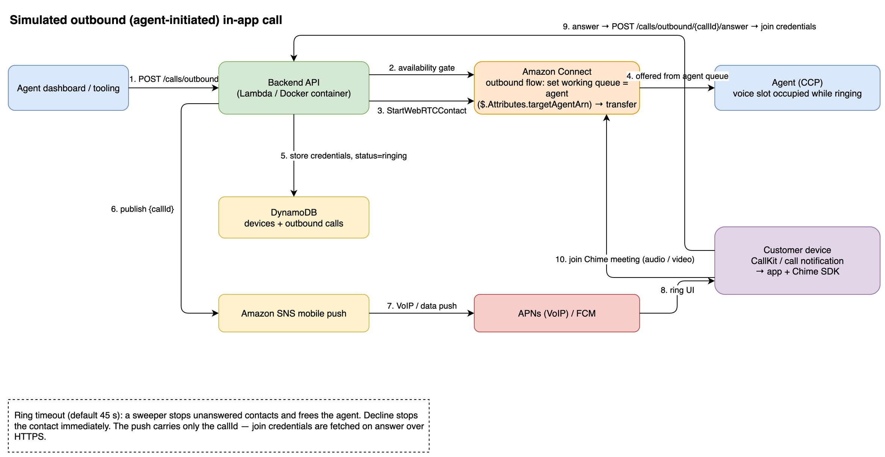

# Agent-initiated ("simulated outbound") in-app calls

This guide covers everything needed to let a **contact-center agent ring the customer's mobile
app** over the same WebRTC/Chime media path the libraries already use for customer-initiated
calls — end to end: backend, Amazon Connect flow, push credentials, native host wiring (iOS +
Android), and the Flutter / React Native app code.



## 1. Why "simulated" outbound

Amazon Connect has **no outbound-WebRTC API**:

- [`StartOutboundVoiceContact`](https://docs.aws.amazon.com/connect/latest/APIReference/API_StartOutboundVoiceContact.html)
  dials **PSTN phone numbers only** — there is no app/WebRTC endpoint option.
- [`StartWebRTCContact`](https://docs.aws.amazon.com/connect/latest/APIReference/API_StartWebRTCContact.html)
  is formally an **inbound** contact — Connect always models the app user as the initiating
  customer.

The loophole: `StartWebRTCContact` is called by **our backend**, not by the device. So the backend
starts the contact *on the customer's behalf*, routes it straight to the initiating agent, and
wakes the customer's phone with a push. From the customer's perspective it is an incoming VoIP
call; from Connect's perspective it is still an inbound WebRTC contact.

> **Reporting caveat:** these calls appear as **inbound** contacts in Connect contact records and
> analytics (initiation method `API`). Use the injected `direction=outbound` contact attribute to
> segment them in reports.

## 2. How a call flows

1. **Agent side** calls `POST /calls/outbound` with `{customerId, agentId, callType}`.
2. The backend **verifies the agent is available** via `GetCurrentUserData` — routable with a free
   VOICE slot — and rejects with `409 AGENT_NOT_AVAILABLE` otherwise. A customer's phone never
   rings for an agent who cannot take the call.
3. The backend calls `StartWebRTCContact` injecting `direction=outbound`,
   `targetAgentArn=<agent ARN>` and `customerId` as contact attributes, using the **outbound
   contact flow** (§4).
4. The flow sets the working queue **to the agent's personal queue** and transfers. The contact is
   offered to the agent immediately — **occupying their voice slot, so Connect offers them no
   other calls while the customer's phone rings**. (Enable *auto-accept* for these agents for a
   zero-click experience, or they accept the inbound toast in CCP.)
5. The backend stores the join credentials server-side and sends a **push that carries only the
   `callId`** — never meeting credentials: APNs **VoIP push** (PushKit) on iOS, **high-priority FCM
   data message** on Android.
6. The library shows the OS incoming-call UI (CallKit / full-screen call notification). On answer,
   the app exchanges the callId for the join credentials (`POST /calls/outbound/{callId}/answer`)
   and joins the Chime meeting — the same media path as an outgoing call.
7. If nobody answers within the ring timeout (default **45 s**, parameter), the backend stops the
   contact and releases the agent (a 1-minute sweeper on Lambda / a 60 s timer in Docker; the
   answer endpoint also lazily times out expired calls). Declining on the device stops the contact
   immediately.

### Agent exclusivity — the guarantees

| Moment | Mechanism |
|---|---|
| Before dialing | `GetCurrentUserData` gate: agent must be routable with ≥1 free voice slot (`409` otherwise). |
| While the phone rings | The contact is already offered to/accepted by the agent via their **agent queue** — the voice slot is occupied, so no other voice contact can be routed to them. |
| Customer never answers | Ring-timeout sweeper stops the contact → agent released. |
| Customer declines | `POST .../decline` stops the contact → agent released immediately. |
| Agent gives up | The agent ends the contact from CCP — that also stops the customer's ring server-side on the next answer attempt (410) and the ring UI times out locally. |

## 3. Backend deployment

### 3.1 Create the SNS platform applications (one-time, holds your push credentials)

Push delivery uses **Amazon SNS mobile push**, so the backend needs no APNs/FCM SDKs and works
with role-based credentials in Docker unchanged.

**iOS — APNS_VOIP** (needs an APNs auth key `.p8` from the Apple Developer portal →
Certificates → Keys → enable APNs):

```bash
# KEY_ID = the APNs key id, TEAM_ID = your Apple Team ID, bundle id gets the ".voip" suffix.
aws sns create-platform-application \
  --name chimeflutter-voip \
  --platform APNS_VOIP \
  --attributes PlatformCredential="$(cat AuthKey_KEY_ID.p8)",PlatformPrincipal="KEY_ID",ApplePlatformTeamID="TEAM_ID",ApplePlatformBundleID="com.your.app.voip"
# Use --platform APNS_VOIP_SANDBOX for debug builds (development APNs environment).
```

**Android — FCM** (needs the Firebase **service-account JSON**, Firebase console → Project
settings → Service accounts → Generate new private key):

```bash
aws sns create-platform-application \
  --name chimeflutter-fcm \
  --platform GCM \
  --attributes PlatformCredential="$(cat service-account.json)"
```

Both commands output a `PlatformApplicationArn` — pass them to the deploy.

### 3.2 Deploy (SAM)

```bash
sam deploy --parameter-overrides \
  ConnectInstanceId=<instance-id> \
  ConnectContactFlowId=<inbound-flow-id> \
  ConnectOutboundContactFlowId=<outbound-flow-id> \   # from §4; empty ⇒ falls back to the inbound flow
  OutboundRingTimeoutSeconds=45 \
  ApnsVoipPlatformApplicationArn=arn:aws:sns:...:app/APNS_VOIP/chimeflutter-voip \
  FcmPlatformApplicationArn=arn:aws:sns:...:app/GCM/chimeflutter-fcm
```

The template adds two DynamoDB tables (`DevicesTable`, `OutboundCallsTable` — pay-per-request,
TTL-cleaned), four Lambda functions, and a 1-minute EventBridge schedule for the ring-timeout
sweeper. Leave the SNS ARNs empty to deploy without outbound push (registration then answers
`501 PUSH_NOT_CONFIGURED`).

### 3.3 Deploy (Docker)

Same container, four extra environment variables — credentials stay **role-based** (task role /
IRSA / instance profile), exactly like the rest of the backend:

```yaml
environment:
  DEVICES_TABLE: chimeflutter-devices          # create the two tables yourself for Docker
  OUTBOUND_CALLS_TABLE: chimeflutter-outbound-calls
  CONNECT_OUTBOUND_CONTACT_FLOW_ID: <outbound-flow-id>
  APNS_VOIP_PLATFORM_APPLICATION_ARN: arn:aws:sns:...
  FCM_PLATFORM_APPLICATION_ARN: arn:aws:sns:...
  # OUTBOUND_RING_TIMEOUT_SECONDS: "45"
```

The container runs the same sweeper on a 60 s in-process timer (only when `OUTBOUND_CALLS_TABLE`
is set). Add to the task role: `dynamodb:GetItem/PutItem/UpdateItem/Scan` on the two tables,
`connect:GetCurrentUserData` + `connect:StartWebRTCContact` + `connect:StopContact` on the
instance, `sns:CreatePlatformEndpoint`, `sns:SetEndpointAttributes`, `sns:Publish` on the platform
apps/endpoints (see the SAM template's per-function policies for the exact shape).

Tables (one-time, for Docker):

```bash
aws dynamodb create-table --table-name chimeflutter-devices \
  --attribute-definitions AttributeName=customerId,AttributeType=S \
  --key-schema AttributeName=customerId,KeyType=HASH --billing-mode PAY_PER_REQUEST
aws dynamodb create-table --table-name chimeflutter-outbound-calls \
  --attribute-definitions AttributeName=callId,AttributeType=S \
  --key-schema AttributeName=callId,KeyType=HASH --billing-mode PAY_PER_REQUEST
aws dynamodb update-time-to-live --table-name chimeflutter-outbound-calls \
  --time-to-live-specification Enabled=true,AttributeName=ttl
```

## 4. Amazon Connect flow (import it yourself — nothing touches your instance automatically)

Import [`docs/connect/chimeflutter-outbound-to-agent.json`](./connect/chimeflutter-outbound-to-agent.json):

1. Replace the one placeholder `${QUEUE_ARN_General}` with your General queue ARN (error fallback).
2. Connect console → **Routing → Flows → Create flow** → **⋮ → Import (beta)** → select the JSON →
   **Save & Publish**. A yellow resource warning before save is normal.
3. Copy the flow ID from the URL (or ARN) and pass it as `ConnectOutboundContactFlowId`.

What it does:

```
setOutboundMarker → setAgentQueue (UpdateContactTargetQueue, AgentId = $.Attributes.targetAgentArn)
                        └─▶ transferToAgentQueue ─▶ (disconnect when the contact ends)
     errors/at-capacity ─▶ setFallbackQueue (${QUEUE_ARN_General}) ─▶ transferToFallbackQueue
```

**Alternative — one combined flow:** keep a single flow for both directions by branching first on
`$.Attributes.direction` (`Compare`): `outbound` → the set-agent-queue path above; anything else →
your existing tier/issueType routing. Then leave `ConnectOutboundContactFlowId` empty.

Also check per agent: **Users → Routing profile** must include the VOICE channel, and (recommended)
enable **auto-accept calls** on the user so the agent leg connects with zero clicks.

## 5. API reference (added endpoints)

| Endpoint | Caller | Purpose |
|---|---|---|
| `POST /v1/devices` | app | Register/refresh the device push token. |
| `POST /v1/calls/outbound` | agent tooling | Start a simulated-outbound call. |
| `GET /v1/calls/outbound/{callId}` | agent tooling | Ring/answer status (no tokens). |
| `POST /v1/calls/outbound/{callId}/answer` | app | Exchange the pushed callId for join credentials. |
| `POST /v1/calls/outbound/{callId}/decline` | app | Decline; stops the contact, releases the agent. |

```bash
# Register a device (the libraries do this for you — see §7/§8)
curl -X POST "$BASE/devices" -H 'Content-Type: application/json' \
  -d '{"customerId":"cust-42","platform":"android","pushToken":"<FCM token>"}'

# Ring a customer (agent side)
curl -X POST "$BASE/calls/outbound" -H 'Content-Type: application/json' \
  -d '{"customerId":"cust-42","agentId":"<connect-user-id>","callType":"audio",
       "callerDisplayName":"Acme Support","context":{"issueType":"billing"}}'
# → 201 {"callId":"...","contactId":"...","status":"ringing","expiresAt":1720000000000}
# → 404 no registered device • 409 AGENT_NOT_AVAILABLE • 502 PUSH_FAILED (contact stopped again)

# Poll until answered (agent side)
curl "$BASE/calls/outbound/$CALL_ID"    # → {"status":"ringing|answered|declined|timedOut|cancelled",...}
```

> ⚠️ **Security:** `POST /calls/outbound` makes customer phones ring and `POST /devices` binds a
> push destination to a customerId. In production BOTH must sit behind authentication —
> `/calls/outbound` restricted to agent/backoffice principals, `/devices` to the signed-in
> customer's own identity. The demo deployment is open, like the rest of the demo API.

## 6. The push payload (what your native handler receives)

Both platforms receive the same data keys — never any meeting credentials:

```json
{
  "type": "incomingConnectCall",
  "callId": "8c9f4a...",
  "callType": "audio",
  "displayName": "Acme Support",
  "timeoutSeconds": "45",
  "correlationId": "..."
}
```

iOS: inside the PushKit `dictionaryPayload` (alongside a minimal `aps`). Android: as
`RemoteMessage.data` of a high-priority data-only message.

## 7. iOS host setup (step by step — required, VoIP pushes cannot be handled in Dart/JS)

Works identically for the Flutter host (add-to-app or pure-Flutter Runner) and the React Native
host — only the import name differs.

**Step 1 — capabilities.** In Xcode, target → *Signing & Capabilities*:
- Add **Push Notifications**.
- Add **Background Modes** → check **Voice over IP**.

**Step 2 — register for VoIP pushes and report incoming calls.** In `AppDelegate.swift`:

```swift
import PushKit
import flutter_amazon_connect_webrtc        // Flutter host
// import react_native_amazon_connect_webrtc  // React Native host (or your pod module name)

extension AppDelegate: PKPushRegistryDelegate {

    /// Call this once at launch (end of didFinishLaunchingWithOptions).
    func registerForVoipPushes() {
        let registry = PKPushRegistry(queue: .main)
        registry.delegate = self
        registry.desiredPushTypes = [.voIP]
    }

    func pushRegistry(_ registry: PKPushRegistry,
                      didUpdate credentials: PKPushCredentials,
                      for type: PKPushType) {
        // Hex-encode the token and hand it to the app layer, which uploads it via
        // controller.registerDevice / POST /devices (see §9 / §10).
        let token = credentials.token.map { String(format: "%02x", $0) }.joined()
        // e.g. stash it where your Dart/JS layer can read it, or POST it natively.
        VoipTokenStore.shared.token = token
    }

    func pushRegistry(_ registry: PKPushRegistry,
                      didReceiveIncomingPushWith payload: PKPushPayload,
                      for type: PKPushType,
                      completion: @escaping () -> Void) {
        let d = payload.dictionaryPayload
        // MUST be called synchronously — Apple terminates apps that receive a VoIP push
        // without reporting a call to CallKit.
        ConnectCallKitManager.shared.reportIncomingCall(
            callId: d["callId"] as? String ?? "",
            displayName: d["displayName"] as? String ?? "Support",
            isVideo: (d["callType"] as? String) == "video",
            timeoutSeconds: Int(d["timeoutSeconds"] as? String ?? "45") ?? 45)
        completion()
    }
}
```

`ConnectCallKitManager.shared` is the library's public CallKit singleton. It shows the native
incoming-call screen immediately — even if the app was killed. When the user answers:

- app already running → your Dart/JS `incomingCallAnswered` event handler fires;
- cold start → the answer is **parked**; call `handlePendingIncomingCall()` at startup (§9/§10).

**Step 3 — token upload.** When `didUpdate credentials` fires, the app must send the token via
`registerDevice` (§9/§10) — the APNs **VoIP** token is different from the normal push token.

> Simulators never receive VoIP pushes — test on a device. Debug builds use the APNs *sandbox*
> environment → register the device against an `APNS_VOIP_SANDBOX` platform application.

## 8. Android host setup (step by step)

**Step 1 — Firebase.** Add your app to a Firebase project, place `google-services.json` in
`app/`, apply the `com.google.gms.google-services` plugin, and add
`com.google.firebase:firebase-messaging` (any recent version).

**Step 2 — a messaging service** that forwards the call push to the library:

```kotlin
import com.google.firebase.messaging.FirebaseMessagingService
import com.google.firebase.messaging.RemoteMessage
import com.chimeflutter.connect_webrtc.ConnectIncomingCallCenter   // Flutter host
// import com.amazonconnectwebrtc.ConnectIncomingCallCenter        // React Native host

class CallMessagingService : FirebaseMessagingService() {

    override fun onMessageReceived(message: RemoteMessage) {
        val data = message.data
        if (data["type"] != "incomingConnectCall") return
        // Shows the full-screen incoming-call notification and starts the ring timeout —
        // works with the app in background or killed (high-priority data message).
        ConnectIncomingCallCenter.reportIncomingCall(
            context = this,
            callId = data["callId"] ?: return,
            displayName = data["displayName"] ?: "Support",
            isVideo = data["callType"] == "video",
            timeoutSeconds = data["timeoutSeconds"]?.toIntOrNull() ?: 45,
        )
    }

    override fun onNewToken(token: String) {
        // Upload via registerDevice (§9/§10) — tokens rotate.
    }
}
```

Manifest (host app):

```xml
<service android:name=".CallMessagingService" android:exported="false">
    <intent-filter>
        <action android:name="com.google.firebase.MESSAGING_EVENT" />
    </intent-filter>
</service>
```

**Step 3 — permissions.** The library manifests already declare `POST_NOTIFICATIONS` and
`USE_FULL_SCREEN_INTENT`; the app must *request* `POST_NOTIFICATIONS` at runtime on Android 13+
(both libraries' permission helpers already include it). Without it the ring notification cannot
be shown while backgrounded.

Answer/Decline on the notification are handled inside the library (`IncomingCallActionReceiver`);
answering brings your app to the foreground and emits `incomingCallAnswered`.

## 9. Flutter app code

```dart
// 1. Once after sign-in: register the device (APNs VoIP token on iOS, FCM token on Android).
final backend = BackendClient(baseUrl: Uri.parse(backendBaseUrl), tokenProvider: myTokens);
await backend.registerDevice(
  customerId: 'cust-42',
  platform: Platform.isIOS ? 'iOS' : 'Android',
  pushToken: voipOrFcmToken,
);

// 2. Listen for ring-UI outcomes.
controller.events.listen((event) async {
  switch (event) {
    case IncomingCallAnswered(:final callId, :final isVideo):
      await controller.answerIncomingCall(
        callId: callId,
        callType: isVideo ? CallType.video : CallType.audio,
      ); // → fetches credentials, joins the call the OS is already showing
    case IncomingCallDeclined(:final callId):
      await controller.declineIncomingCall(callId); // releases the agent immediately
    default:
  }
});

// 3. Cold start: the user may have answered before Flutter was running.
final resumed = await controller.handlePendingIncomingCall();

// 4. (Android, if you receive FCM in Dart via firebase_messaging instead of a native service)
await controller.reportIncomingCall(
  callId: data['callId']!, displayName: data['displayName'] ?? 'Support',
  isVideo: data['callType'] == 'video',
  timeoutSeconds: int.tryParse(data['timeoutSeconds'] ?? '') ?? 45,
);
```

`answerIncomingCall` behaves exactly like `startCall` from there on — same states, events, video
tiles, mute/speaker/DTMF controls.

## 10. React Native app code

```tsx
// 1. Once after sign-in
await backendClient.registerDevice('cust-42', Platform.OS === 'ios' ? 'iOS' : 'Android', token);

// 2. Ring-UI outcomes
controller.onEvent(async (event) => {
  if (event.type === 'incomingCallAnswered') {
    await controller.answerIncomingCall(event.callId, event.isVideo ? 'video' : 'audio');
  } else if (event.type === 'incomingCallDeclined') {
    await controller.declineIncomingCall(event.callId);
  }
});

// 3. Cold start
const resumed = await controller.handlePendingIncomingCall();

// 4. (Android, if FCM is handled in JS via @react-native-firebase/messaging)
await controller.reportIncomingCall(data.callId, data.displayName ?? 'Support',
  data.callType === 'video', Number(data.timeoutSeconds ?? 45));
```

Brownfield hosts additionally see `incomingCallAnswered`/`incomingCallDeclined` on the existing
native host channels (`Notification.Name.connectWebrtcEvent` on iOS, `ConnectWebrtcHostEvents` on
Android), so a native screen can react without JS.

## 11. Troubleshooting & caveats

| Symptom | Cause / fix |
|---|---|
| `409 AGENT_NOT_AVAILABLE` | Agent not in a routable status or voice slot busy — check CCP status and routing profile VOICE channel. |
| `404` from `POST /calls/outbound` | Customer never registered a device — call `POST /devices` first. |
| `501 PUSH_NOT_CONFIGURED` | The platform-application ARN for that OS wasn't set at deploy time. |
| iOS push arrives, app crashes seconds later | `reportIncomingCall` wasn't called synchronously in the PushKit callback — Apple enforces this. |
| iOS device never gets pushes in debug | Debug builds use the APNs sandbox — use an `APNS_VOIP_SANDBOX` platform application. |
| Android rings only in foreground | `POST_NOTIFICATIONS` denied, or the FCM message was sent as "notification" type instead of data-only (the backend always sends data-only). |
| Agent connects, hears silence, then customer joins | Expected: the agent leg is bridged while the customer's phone still rings. Keep ring timeout modest (30–60 s). |
| Answered on device but `410 CALL_NO_LONGER_RINGING` | Ring deadline passed (or declined/cancelled elsewhere) — the backend already released the agent. |
| Call shows as *inbound* in Connect reports | By design (§1) — segment on the `direction=outbound` attribute. |
| Decline while app killed doesn't stop the contact instantly | The decline can't reach the backend without JS/Dart; the ring-timeout sweeper releases the agent at the deadline. |
