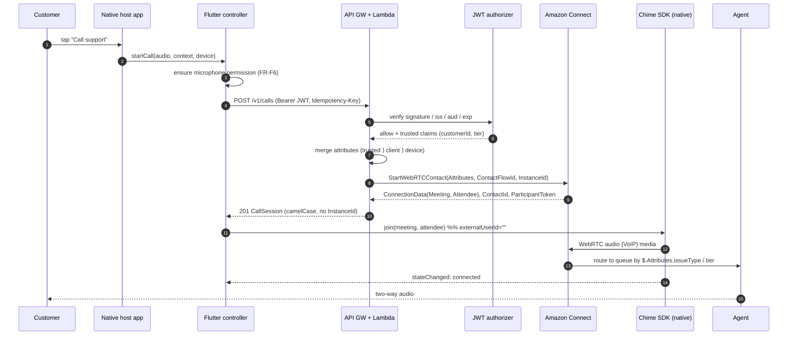
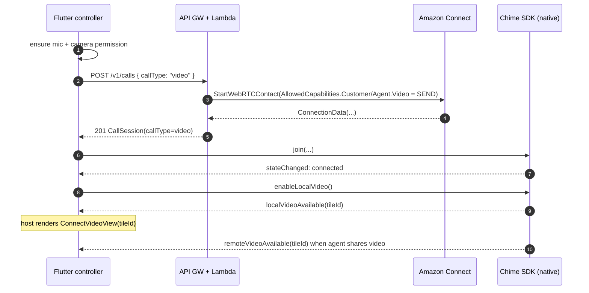
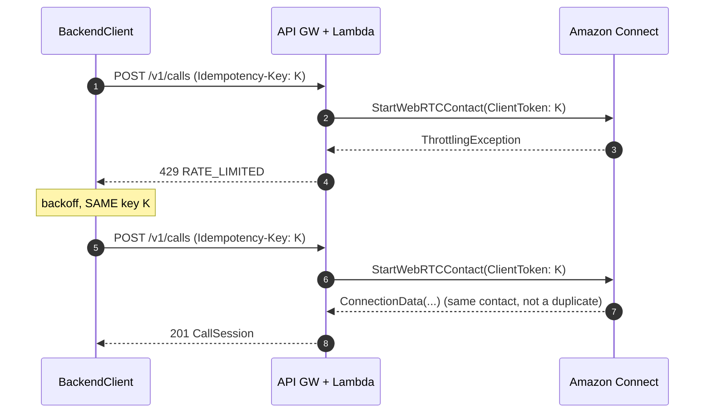
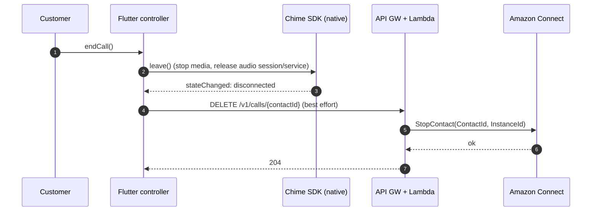
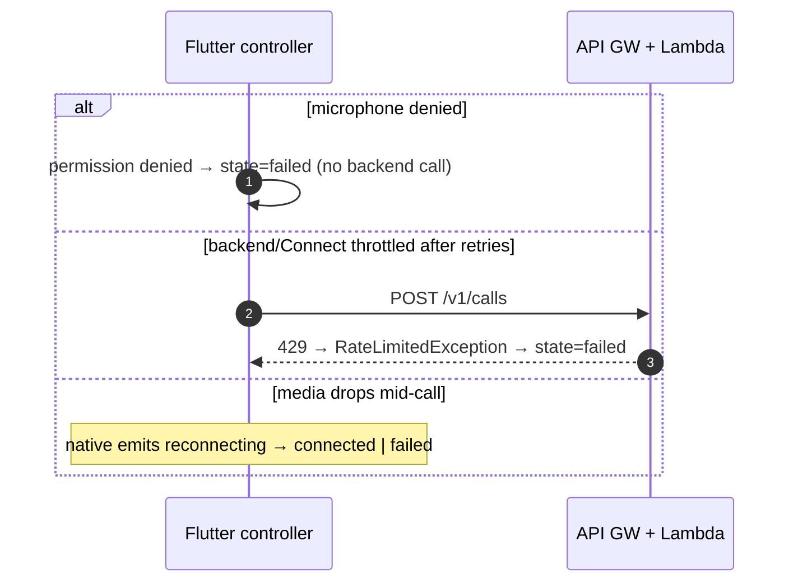

# 004 — Sequence Diagrams

**Related:** [002-architecture](./002-architecture.md) · [003-api-contracts](./003-api-contracts.md)

## 1. Start an audio (VoIP) call, routed by context

## 2. Start a video (WebRTC) call

## 3. Idempotent retry on throttling

## 4. End a call

## 5. Failure paths

